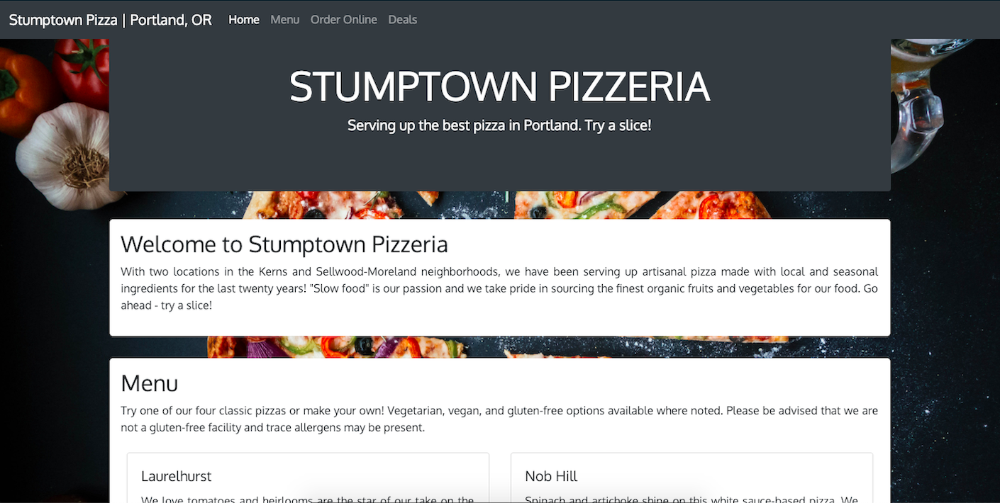
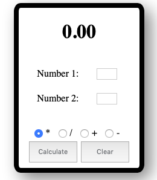
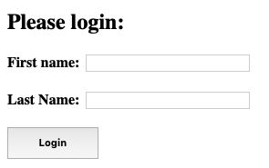

# The Tech Academy - JavaScript Coding Projects
## The Pizza Project
For this project, we were asked to create a simple web-based order form out of JavaScript for a pizza company. 

I took the assignment to the next level and leveraged Bootstrap 4 to make the website attractive and eye-catching.

## Calculator and JSLogin
 

Simple, small coding projects, creating a calculator and a login form out of JavaScript.
